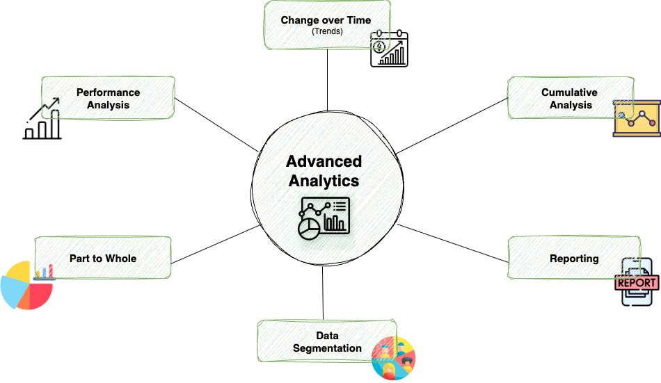

# 📊 SQL ADVANCED ANALYTICS PROJECT 

<div align="center">

[](https://www.python.org/)
[](https://www.postgresql.org/)
[](https://pandas.pydata.org/)
[](https://www.sqlalchemy.org/)
[](https://opensource.org/licenses/MIT)

</div>

---

### **A comprehensive data analytics project showcasing advanced SQL techniques, data pipeline construction, and business intelligence reporting.**

This repository contains a complete data analytics workflow, starting from raw data extraction and moving through exploratory data analysis (EDA), advanced analytics, and finally to actionable business insights. It is designed to demonstrate a strong foundation in data manipulation, analysis, and interpretation using a powerful and scalable tech stack.

---

## 🌟 Why This Project Matters

In a data-driven world, the ability to extract meaningful insights from complex datasets is paramount. This project serves as a practical demonstration of end-to-end data analysis, mirroring the challenges and workflows faced by data professionals in top-tier companies. It showcases not just technical proficiency in SQL and Python, but also the analytical mindset required to turn data into a strategic asset. 
---

## 🗺️ Exploratory Data Analysis (EDA) Highlights

- 
- 
The EDA phase was crucial for building a foundational understanding of the data. Key areas of exploration included:

-   **Database & Schema Exploration**: Understanding table structures, data types, and relationships.
-   **Dimension Analysis**: Profiling customer and product dimensions to understand their attributes.
-   **Time-Series Exploration**: Analyzing sales data over time to identify trends and seasonality.
-   **Measures & Metrics**: Calculating key performance indicators (KPIs) like total sales, average order value, and customer lifetime value.
-   **Magnitude & Ranking**: Identifying top-performing products, high-value customers, and sales outliers.
  
## 🧠 Advanced Analytics & Insights

-
Building on the EDA, advanced SQL queries were developed to uncover deeper insights:

-   **Time-Based Analysis**:
    -   **Changes Over Time**: Calculated month-over-month and year-over-year growth in sales and customer acquisition.
    -   **Cumulative Growth**: Tracked cumulative sales to visualize long-term performance trends.
-   **Customer & Product Segmentation**:
    -   **Data Segmentation**: Grouped customers based on purchasing behavior (e.g., frequency, monetary value).
    -   **Part-to-Whole Analysis**: Determined the contribution of each product category to overall revenue.
-   **Performance Metrics**:
    -   **Performance Analysis**: Assessed product and sales performance against historical benchmarks.
    -   **Custom Reports**: Generated detailed reports on customer demographics and product performance.

---

## ⚙️ Data Pipeline

The data pipeline is built with Python, using `pandas` for data manipulation and `SQLAlchemy` for database interaction.

```python
# Example of data extraction logic
import pandas as pd
from sqlalchemy import create_engine

def extract_data(source_connection_string, destination_connection_string):
    """
    Connects to a source database, extracts data from specified tables,
    and loads it into a destination data warehouse.
    """
    # Connect to source and destination
    source_engine = create_engine(source_connection_string)
    dest_engine = create_engine(destination_connection_string)

    # Define tables to extract
    tables = ['customers', 'products', 'sales']

    # Extract and load data
    for table in tables:
        df = pd.read_sql(f'SELECT * FROM {table}', source_engine)
        df.to_sql(f'dim_{table}', dest_engine, if_exists='replace', index=False)

    print("Data extraction and loading complete.")

```

This script automates the process of moving data from an operational database to our analytics environment, ensuring data is fresh and ready for analysis.

---

## Technology Stack

This project is centered around a SQL Server-based data analytics pipeline, with Python scripts for data extraction and SQL scripts for analysis.

#### **Data Storage and Warehousing**

-   **Database**: **Microsoft SQL Server**. The entire project is built around a SQL Server database named `DataWarehouseAnalytics`. The SQL scripts (`.sql`) are written in Transact-SQL (T-SQL), the dialect of SQL used by Microsoft SQL Server.
-   **Database Schema**: The project utilizes a `gold` schema, which suggests a medallion architecture for the data warehouse. This typically means the data has been cleaned, transformed, and aggregated into a high-quality, analysis-ready format.

#### **Data Extraction and Processing**

-   **Programming Language**: **Python**. The `extract_data.py` script is used to connect to the SQL Server database and extract data into CSV files.
-   **Python Libraries**:
    -   **`pandas`**: Used for data manipulation and analysis, particularly for reading data from SQL Server and writing it to CSV files in chunks.
    -   **`SQLAlchemy`**: Provides a high-level API for connecting to databases. It is used to create the connection engine to the SQL Server.
    -   **`pyodbc`**: Serves as the ODBC driver for connecting Python to the SQL Server database.
    -   **`python-dotenv`**: Used for managing environment variables, such as database credentials.

#### **Data Analysis and Reporting**

-   **Analysis Language**: **SQL (T-SQL)**. The core of the data analysis is performed through a comprehensive set of SQL scripts located in the `scripts/` directory. These scripts cover:
    -   **Exploratory Data Analysis (EDA)**: Basic exploration of the database, dimensions, measures, and key metrics.
    -   **Advanced Analytics**: More complex analyses including time-series, cumulative trends, data segmentation, and performance analysis.
-   **Reporting**: The analysis results are intended to be summarized in Markdown reports (`.md`) located in the `docs/report/` directory.

#### **Diagramming and Documentation**

-   **Diagrams**: The project uses **draw.io** for creating diagrams (e.g., `advanced_analysis.drawio.png`). These are likely used for visualizing data models, analysis flows, or architectures.
-   **Documentation**: Project documentation is maintained in **Markdown** files (`.md`).

---

## 🔑 Key Features

-   **📁 End-to-End Data Pipeline**: A Python-based pipeline that extracts data from source systems, preparing it for analysis.
-   **📈 Exploratory Data Analysis (EDA)**: A deep dive into the dataset to uncover initial patterns, anomalies, and characteristics.
-   **🧠 Advanced Analytics**: Application of advanced SQL techniques to answer complex business questions.
-   **📊 BI Reporting**: SQL queries designed to feed directly into business intelligence dashboards for clear and concise reporting.
-   **📂 Organized & Scalable**: A well-structured project with clear naming conventions and modular scripts.
---
## 📊 BI Reproting

-  The dashboards are present in this repository 'https://github.com/dvy246/tableau-project.git'
  
## Configuration

The project's settings are managed in `scripts/config/settings.yaml`. This file allows you to configure the database connection, data extraction parameters, and logging without changing the Python code.

-   **Database**: Set your SQL Server host, port, database, and username here.
-   **Data Extraction**: Define which tables to extract and where to save them.
-   **Logging**: Configure the log file and logging level.

For security, the database password is not stored in this file. Instead, it is loaded from a `.env` file at the root of the project. Simply create a `.env` file and add your password like this:

## 🏁 Getting Started

To get this project running locally, follow these steps:

1.  **Clone the repository:**
    ```bash
    git clone https://github.com/your-username/sql-data-analytics-project.git
    cd sql-data-analytics-project
    ```

2.  **Install dependencies:**
    ```bash
    pip install -r requirements.txt
    ```

3.  **Set up the database:**
    -   Ensure you have a running instance of PostgreSQL or SQL Server.
    -   Restore the database using the backup file provided in the `database/backup/` directory.

4.  **Run the analytics scripts:**
    -   Connect to your database using a SQL client of your choice.
    -   Execute the scripts in the `scripts/` directory to perform the analysis.

---

## 📫 Let's Connect!

I'm passionate about using data to solve complex problems and drive business value. If you'd like to discuss this project further or explore potential opportunities, please feel free to connect with me.

<div align="center">

[](https://www.linkedin.com/in/divy-yadav/)
[](https://github.com/divy-yadav)

</div>
